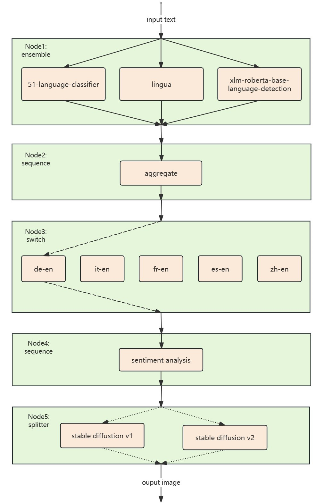

# EmotionVis

This project innovatively designed and implemented a cloud-native machine learning application named EmotionVis. It can visualize the emotions conveyed by the text. It accepts input text in multiple languages (English, Chinese, French, Spanish, German, Russian), analyzes the emotions within the text, and generates an image that expresses the corresponding emotions. The application boasts commendable performance, scalability, and fault tolerance.

It is built on Kubernetes and Kserve.

## End to End Example

**Input:**
```json
[
  {
    "instances": [
      "好担心作业能不能在截止日期前写完。"
    ]
  }
] 
```
**Output:**


## Setup
- Kubernetes v1.29
- KServe v0.11.0

## Deploy the application
First deploy all the inference services
```shell
kubectl apply -f apply.sh
```
Make sure all the services are running
```shell
kubectl get isvc
```
Then deploy the inference graph
```shell
kubectl apply -f inferencegraph.yaml
```
Get the url
```shell
kubectl get ig
```

## Test the application
Send http requests in a single thread：
[test-ig.py](test-ig.py)

Send http requests in multiple threads：
[multi-clinet.py](multi-client.py)

⭐ Remember to change the url to your own. You can also specify the number of requests and concurrent work in the file.


## Architecture



## Clear all InferenceService
```shell
kubectl delete ig all
kubectl delete isvc all
```